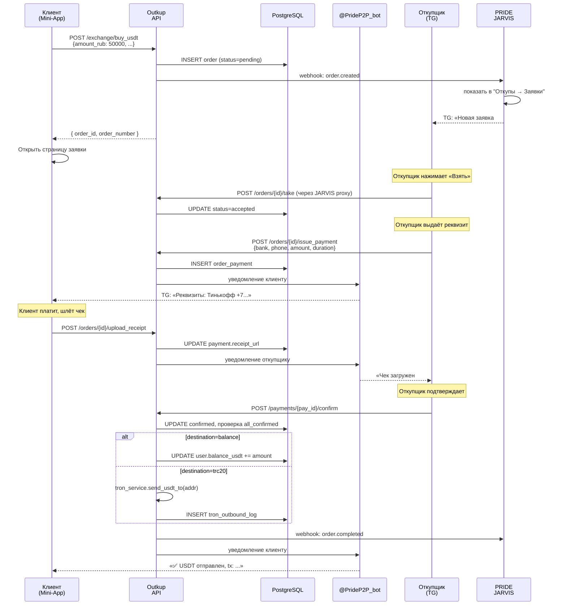
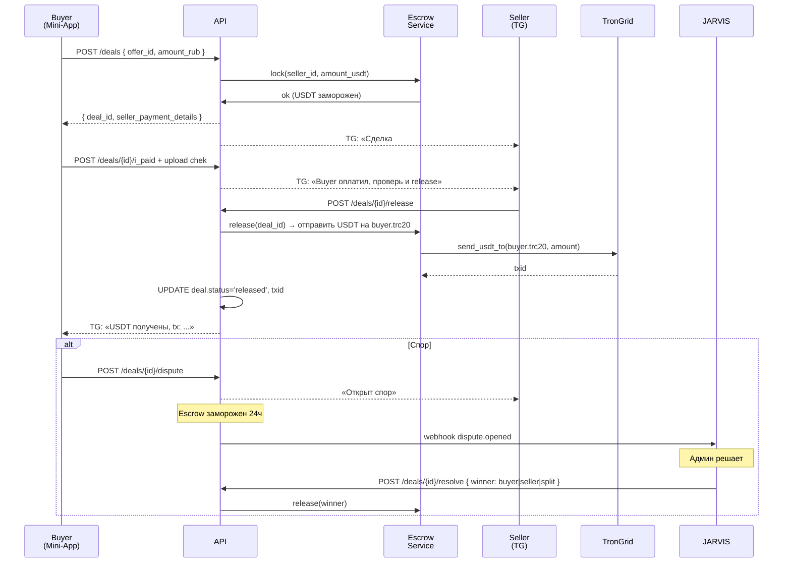
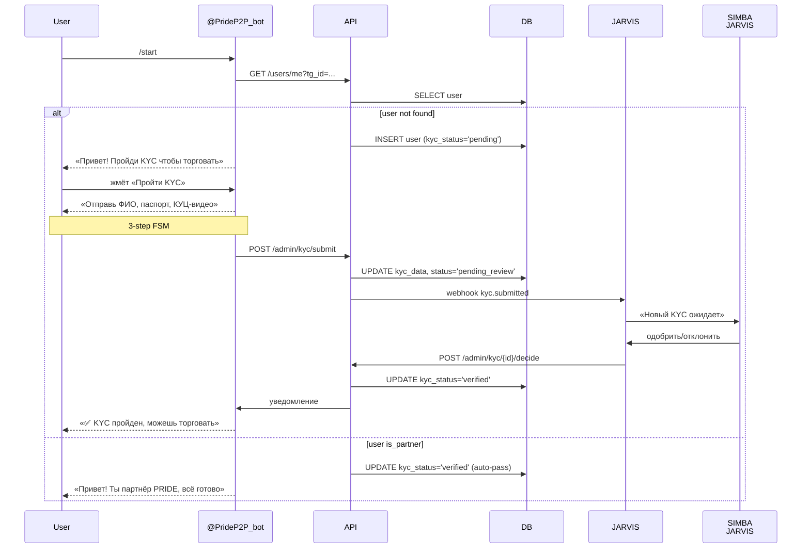

# PRIDE P2P — Detailed Design Document

> Дополнение к [`OUTKUP_SERVICE_PLAN.md`](./OUTKUP_SERVICE_PLAN.md). Здесь — конкретные мокапы Mini-App, API-спека, sequence diagrams, структура репо. Читать после плана.
>
> **Bot:** `@PrideP2P_bot` · **Backend host:** Railway-default · **Stack:** aiogram + FastAPI + PostgreSQL + Vue 3 (Mini-App)
>
> Версия 1 — 2026-06-07

---

## 1. Структура нового репо `pride-outkup-service`

```
pride-outkup-service/
├── README.md
├── Dockerfile
├── railway.toml
├── pyproject.toml                  # poetry
├── requirements.txt
├── .env.example
│
├── bot/                            # aiogram bot
│   ├── __init__.py
│   ├── main.py                     # entry point
│   ├── handlers/
│   │   ├── start.py                # /start + welcome
│   │   ├── kyc.py                  # KYC flow в ЛС
│   │   ├── orders.py               # уведомления о заявках
│   │   ├── deals.py                # уведомления о сделках (P2P)
│   │   └── groups.py               # команды в группах (/курс)
│   ├── keyboards.py
│   └── middlewares.py
│
├── api/                            # FastAPI backend для Mini-App
│   ├── __init__.py
│   ├── main.py                     # FastAPI app
│   ├── auth.py                     # Telegram WebApp initData verify
│   ├── routers/
│   │   ├── users.py                # /api/v1/users/me, /balance
│   │   ├── orders.py               # V1: /api/v1/orders/*
│   │   ├── exchange.py             # V1: /api/v1/exchange/buy_usdt, /sell_usdt
│   │   ├── offers.py               # V2: /api/v1/offers/*
│   │   ├── deals.py                # V2: /api/v1/deals/*
│   │   ├── disputes.py             # V2: /api/v1/disputes/*
│   │   ├── webhooks.py             # incoming webhooks (TronGrid)
│   │   └── admin.py                # admin actions (модерация KYC, споры)
│   └── deps.py                     # FastAPI Depends (current_user, db_session)
│
├── core/                           # общая бизнес-логика
│   ├── __init__.py
│   ├── config.py                   # settings из env
│   ├── db.py                       # SQLAlchemy engine + session
│   ├── models/                     # SQLAlchemy models
│   │   ├── user.py
│   │   ├── order.py
│   │   ├── order_payment.py
│   │   ├── offer.py
│   │   ├── deal.py
│   │   ├── escrow.py
│   │   └── dispute.py
│   ├── schemas/                    # Pydantic schemas (DTO для API)
│   │   ├── user.py
│   │   ├── order.py
│   │   └── ...
│   ├── services/                   # бизнес-логика
│   │   ├── order_service.py        # V1: создание/обновление orders
│   │   ├── exchange_service.py     # V1: расчёт курса/комиссии
│   │   ├── escrow_service.py       # V2: блокировка/release USDT
│   │   ├── deal_service.py         # V2: создание deal из offer
│   │   ├── kyc_service.py          # верификация KYC
│   │   ├── tron_service.py         # отправка USDT (port from workchat-bot)
│   │   └── jarvis_sync.py          # webhook'и в JARVIS
│   └── utils/
│       ├── telegram_auth.py        # verify initData
│       └── hmac.py
│
├── miniapp/                        # frontend Mini-App (Vue 3)
│   ├── index.html
│   ├── package.json
│   ├── vite.config.ts
│   ├── src/
│   │   ├── main.ts
│   │   ├── App.vue
│   │   ├── pages/
│   │   │   ├── Balance.vue
│   │   │   ├── Exchange.vue        # V1 tab 2: buy/sell USDT
│   │   │   ├── Orders.vue          # V1 tab 3: business outkup
│   │   │   ├── ActiveOrder.vue     # detail page
│   │   │   ├── P2PBoard.vue        # V2 tab 4
│   │   │   ├── OfferDetail.vue     # V2: detail
│   │   │   ├── ActiveDeal.vue      # V2: deal in progress
│   │   │   └── Profile.vue
│   │   ├── components/
│   │   │   ├── BottomTabs.vue
│   │   │   ├── OrderCard.vue
│   │   │   ├── OfferCard.vue
│   │   │   ├── TimerCountdown.vue
│   │   │   └── ChatBox.vue
│   │   ├── api/
│   │   │   └── client.ts           # fetch wrapper with auth
│   │   └── stores/                 # Pinia
│   │       ├── user.ts
│   │       ├── orders.ts
│   │       └── deals.ts
│   └── dist/                       # build output, served by FastAPI
│
├── migrations/                     # alembic
│   └── versions/
│
├── scripts/
│   ├── import_partners.py          # one-off: импорт partners из workchat-bot
│   └── seed_dev.py                 # тестовые данные
│
└── tests/
    ├── test_orders.py
    └── test_escrow.py
```

---

## 1.5. Design System (утверждено SIMBA 2026-06-09)

Стиль референса — Crypto Bot (Wallet). Минимализм, тёмно-серый, **без яркого голубого акцента**.

### Палитра

```css
:root {
  --bg:       #1d2433;              /* Фон main */
  --card:     rgba(255,255,255,0.04); /* Карточки */
  --card-hi:  rgba(255,255,255,0.07); /* Карточки accent / iconcircle */
  --text:     #ffffff;              /* Primary text */
  --text-2:   #c2c7d2;              /* Secondary */
  --text-3:   #8e95a8;              /* Tertiary / hints */
  --border:   rgba(255,255,255,0.06);
  --success:  #22c55e;
  --warning:  #fbbf24;
  --danger:   #ef4444;
  --pill-bg:  rgba(40,46,62,0.85);  /* Bottom-nav blur bg */
}
```

### Правила

- **Primary button** = белый бг `#fff`, тёмный текст `var(--bg)`, `border-radius: 28px`, padding 14px
- **Secondary button** = `rgba(255,255,255,0.08)` бг, белый текст
- **Иконки в круге** — `var(--card-hi)`, иконка `var(--text-2)`, радиус 50%
- **Карточки** — `var(--card)`, radius 14px, padding 14px
- **Bottom nav** — pill с `backdrop-filter: blur(20px)`, активный таб подсвечен `rgba(255,255,255,0.07)`
- **Sticky pill сверху** (KYC progress) — круг + текст в полупрозрачной плашке
- **Шрифты** — SF Pro Display / system, веса 400/500 (никаких 600+)
- **Цветовые акценты**: success зелёный — для верификации/успехов; warning жёлтый — таймер/предупреждение; danger красный — % падения/отмены/споры
- **НЕТ**: ярко-голубого, градиентов, теней, неона

### Типографика

| Элемент | size | weight | color |
|---------|------|--------|-------|
| Page title | 18px | 500 | text |
| Balance amount | 36px | 500 | text |
| Card title | 14px | 500 | text |
| Label | 12-13px | 400 | text-2 |
| Hint / sub | 10-11px | 400 | text-3 |

## 2. Mockups Mini-App (V1)

### 2.1. Главный экран — Баланс (стартовый таб)

```
┌──────────────────────────────────────┐
│ 💱 PRIDE P2P             [@user]  ⚙️ │ ← header sticky, аватарка/username
├──────────────────────────────────────┤
│                                      │
│  Ваш баланс PRIDE                    │
│                                      │
│       1 234.56 USDT                  │
│      ≈ 103 700 ₽                     │
│                                      │
│  ┌────────────┐  ┌────────────┐     │
│  │ 💸 Вывести │  │ 📥 Пополнить│     │
│  └────────────┘  └────────────┘     │
│                                      │
│  📊 Статистика                       │
│  • Всего заработано: 5 678.90 USDT  │
│  • Уже выплачено:    4 444.34 USDT  │
│  • Активных заявок:  2              │
│                                      │
│  TRC20-адрес для выплат:             │
│  ┌──────────────────────────────┐   │
│  │ TR...8765         [✏️ изменить]│   │
│  └──────────────────────────────┘   │
│                                      │
│  📜 Последние операции               │
│  ┌──────────────────────────────┐   │
│  │ +595.68 USDT  ✅ Откуп #0029 │   │
│  │ —1107.05 USDT 💸 Выплата TR..│   │
│  │ +250.00 USDT  ✅ Откуп #0028 │   │
│  │ [Посмотреть все →]           │   │
│  └──────────────────────────────┘   │
│                                      │
├──────────────────────────────────────┤
│  💰        🔄        📋        🏛   │ ← bottom tabs sticky
│ Баланс  Обмен   Заявки   P2P (V2)   │
└──────────────────────────────────────┘
```

### 2.2. Таб 2 — Обмен (V1: PRIDE контрагент)

```
┌──────────────────────────────────────┐
│  💱 Обмен USDT ↔ RUB                 │
│  ┌────────────┐  ┌────────────┐     │
│  │ Купить USDT │  │ Продать USDT│   │ ← toggle
│  └─[ACTIVE]───┘  └────────────┘     │
│                                      │
│  Курс PRIDE: 84.00 ₽/USDT 🟢         │
│  (обновлено 2 мин назад)             │
│                                      │
│  ┌────────────────────────────────┐ │
│  │ Я отдаю                         │ │
│  │ ┌─────────────────┐  [RUB ▼]    │ │
│  │ │     50 000      │             │ │
│  │ └─────────────────┘             │ │
│  └────────────────────────────────┘ │
│                  ⇅                   │
│  ┌────────────────────────────────┐ │
│  │ Я получаю                       │ │
│  │ ┌─────────────────┐  [USDT ▼]   │ │
│  │ │   595.68        │             │ │
│  │ └─────────────────┘             │ │
│  └────────────────────────────────┘ │
│                                      │
│  Комиссия 3.5%: 1 750 ₽ (учтено)    │
│                                      │
│  Метод оплаты:                       │
│  [Тинькофф ✓] [Сбер] [Альфа] [Озон] │
│                                      │
│  Куда зачислить USDT:                │
│  ( ) Мой баланс PRIDE                │
│  (•) TRC20-адрес TR...8765 ✏️       │
│                                      │
│  ┌────────────────────────────────┐ │
│  │      ✅ Создать заявку          │ │
│  └────────────────────────────────┘ │
└──────────────────────────────────────┘
```

После создания заявки → переход на страницу ActiveOrder (см. 2.5).

### 2.3. Таб 2 — Обмен (Продать USDT)

```
┌──────────────────────────────────────┐
│  Курс PRIDE: 82.00 ₽/USDT 🟢         │
│  (на продажу — меньше, наша маржа)   │
│                                      │
│  Я отдаю:    [ 100.00 USDT ▼ ]      │
│              ⇅                       │
│  Я получаю:  [ 8 200 ₽ ▼ ]          │
│                                      │
│  Откуда списать USDT:                │
│  (•) С моего баланса PRIDE           │
│      доступно 1 234.56 USDT          │
│  ( ) Прислать USDT на наш hot-wallet │
│      TRC...PRIDE_HOT (без баланса)   │
│                                      │
│  Куда зачислить RUB:                 │
│  Банк:      [Тинькофф ▼]             │
│  Номер карты/телефон:                │
│  [ +7 999 123 4567                ]  │
│                                      │
│  ┌────────────────────────────────┐ │
│  │      ✅ Создать заявку          │ │
│  └────────────────────────────────┘ │
└──────────────────────────────────────┘
```

### 2.4. Таб 3 — Заявки на откуп бизнес-счёта (для партнёров)

```
┌──────────────────────────────────────┐
│  📋 Откуп бизнес-счёта                │
│                                      │
│  Используется для крупных оборотов   │
│  (от 100 000 ₽). Сумма разбивается   │
│  на части, откупщики выдают          │
│  реквизиты по частям.                │
│                                      │
│  ┌────────────────────────────────┐ │
│  │ Сумма входа RUB:                │ │
│  │ [        500 000        ]      │ │
│  │                                 │ │
│  │ Банк входа:                     │ │
│  │ [ Тинькофф ▼ ]                  │ │
│  │                                 │ │
│  │ К получению: 5 952.38 USDT     │ │
│  │ (курс 84.0 — 3.5% маржа)       │ │
│  │                                 │ │
│  │ Зачислить:                      │ │
│  │ ( ) На баланс PRIDE             │ │
│  │ (•) TRC20: TR...8765            │ │
│  │                                 │ │
│  │ [✅ Отправить заявку]           │ │
│  └────────────────────────────────┘ │
│                                      │
│  📊 Мои активные заявки              │
│  ┌────────────────────────────────┐ │
│  │ #0029  500 000 ₽ FULL          │ │
│  │ →5 952.38 USDT                  │ │
│  │ ⏳ Идёт работа (партиями)       │ │
│  │ Выдано: 3/4 реквизита           │ │
│  │ Откупщик: @ivan_p               │ │
│  │ [ Открыть →]                    │ │
│  └────────────────────────────────┘ │
└──────────────────────────────────────┘
```

### 2.5. Активная заявка / сделка (детальный экран)

```
┌──────────────────────────────────────┐
│ ← Назад            Заявка #0029   ⋮ │
├──────────────────────────────────────┤
│                                      │
│  500 000 ₽ → 5 952.38 USDT          │
│  Курс 84.0 · Тинькофф · TR...8765   │
│                                      │
│  Статус:                             │
│  ✅ Принята                          │
│  ✅ Реквизит выдан (1/4)             │
│  ⏳ Ждём чек                          │
│                                      │
│  ┌────────────────────────────────┐ │
│  │ 💳 Реквизит #pay13              │ │
│  │ Банк: Тинькофф                  │ │
│  │ Карта/тел: +79998886565         │ │
│  │ Сумма: 45 000 ₽                 │ │
│  │ ⏱ Осталось: 12:45               │ │
│  │                                 │ │
│  │ ┌─────────────────────────────┐│ │
│  │ │ 📷 Загрузить чек             ││ │
│  │ └─────────────────────────────┘│ │
│  └────────────────────────────────┘ │
│                                      │
│  Остаток: 455 000 ₽                  │
│  (ждём следующий реквизит)           │
│                                      │
│  💬 Чат с откупщиком (3 сообщения)   │
│  ┌────────────────────────────────┐ │
│  │ @ivan_p: «Реквизит выдан»      │ │
│  │ Вы: «Оплачу сейчас»            │ │
│  │ @ivan_p: «Жду чек»             │ │
│  │ [Открыть чат →]                 │ │
│  └────────────────────────────────┘ │
│                                      │
│  [⚠️ Открыть спор]  [❌ Отменить]   │
└──────────────────────────────────────┘
```

### 2.6. Таб 4 (V2) — P2P Биржа

```
┌──────────────────────────────────────┐
│ 🏛 P2P Биржа                          │
│                                      │
│ ┌─────────────┐ ┌─────────────┐    │
│ │ Купить USDT │ │ Продать USDT│    │ ← внутр toggle
│ └─[ACTIVE]────┘ └─────────────┘    │
│                                      │
│ Я хочу купить: [ 50 000 ₽ ▼ ]       │
│ Метод оплаты:  [Тинькофф] [Сбер]    │
│ ☑ Только online (последние 5 мин)   │
│                                      │
│ ─── Лучшие предложения ───           │
│                                      │
│ ┌────────────────────────────────┐  │
│ │ @ivan_petrov  ⭐4.9 (123)       │  │
│ │ 🟢 online                       │  │
│ │ ▼ 84.20 ₽/USDT                 │  │
│ │ Лимит: 10к — 500к ₽            │  │
│ │ 🏦 Тинькофф, Сбер              │  │
│ │ ⏱ 15 мин на оплату             │  │
│ │              [ Купить ]         │  │
│ └────────────────────────────────┘  │
│                                      │
│ ┌────────────────────────────────┐  │
│ │ @maria_t  ⭐4.7 (89)            │  │
│ │ 🟡 5 мин назад                 │  │
│ │ ▼ 84.30 ₽/USDT                 │  │
│ │ Лимит: 5к — 200к ₽             │  │
│ │ ...                             │  │
│ └────────────────────────────────┘  │
│                                      │
│  [+ Создать своё объявление]         │
└──────────────────────────────────────┘
```

### 2.7. Профиль

```
┌──────────────────────────────────────┐
│ 👤 Профиль                            │
│                                      │
│ @username  ⭐4.85 (156 сделок)       │
│ Зарегистрирован: 12 мая 2026         │
│ KYC: ✅ Verified                     │
│                                      │
│ 💰 Баланс PRIDE:  1 234.56 USDT     │
│ 🏦 TRC20:         TR...8765 ✏️      │
│                                      │
│ Статистика:                          │
│ • Всего сделок: 156                  │
│ • % завершённых: 98.7                │
│ • Среднее время: 4 мин               │
│ • Споры: 1 (выиграны)                │
│                                      │
│ ⚙️ Настройки:                        │
│ • 🔔 Уведомления                     │
│ • 🌐 Язык: Русский                   │
│ • 🔐 KYC документы                   │
│ • 📞 Поддержка                       │
│ • 📜 Условия использования           │
│                                      │
│ [ 🚪 Выйти ]                         │
└──────────────────────────────────────┘
```

---

## 3. API Specification

Base URL: `https://pride-outkup-service-production.up.railway.app/api/v1`

Auth: header `X-Telegram-InitData: <initData>` — backend проверяет HMAC через bot-token.

### 3.1. Users

```
GET    /users/me
       → { id, tg_id, username, kyc_status, balance_usdt, trc20_address, is_partner }

PATCH  /users/me
       body: { trc20_address?, notifications_enabled? }
       → { ok: true, user }

GET    /users/me/balance
       → { balance_usdt, total_earned, total_paid, pending_usdt }

GET    /users/me/operations?since=ts&limit=50
       → { items: [{ type: 'earn'|'payout'|'fee', amount_usdt, ref_id, created_at }] }

POST   /users/me/withdraw
       body: { amount_usdt, trc20_address? }  # если не указан — берём профиль
       → { ok, withdraw_id, status: 'pending' }
```

### 3.2. V1 — Exchange (PRIDE контрагент)

```
GET    /exchange/rate
       → { buy: 84.0, sell: 82.0, fee_pct: 3.5, updated_at }

POST   /exchange/buy_usdt
       body: {
         amount_rub: 50000,
         payment_method: 'tinkoff',
         destination: 'balance'|'trc20',
         destination_addr?: 'TR...'
       }
       → { ok, order_id, order_number: '#O0029', amount_usdt: 595.68 }

POST   /exchange/sell_usdt
       body: {
         amount_usdt: 100,
         source: 'balance'|'incoming',
         payment_method: 'tinkoff',
         bank_card_or_phone: '+79991234567',
       }
       → { ok, order_id, amount_rub: 8200 }
```

### 3.3. V1 — Orders (общий контроллер для всех типов)

```
GET    /orders?status=active   # мои активные
       → { items: [{ id, order_number, kind, amount_rub, amount_usdt, status, ... }] }

GET    /orders/{id}
       → { order, payments: [...], chat_messages: [...] }

POST   /orders/business_outkup
       body: { amount_rub, bank_in, destination, destination_addr? }
       → { ok, order_id, order_number }

POST   /orders/{id}/upload_receipt
       multipart: file=<image|pdf>, payment_id=<pay13>
       → { ok, receipt_url }

POST   /orders/{id}/cancel
       → { ok, status: 'cancelled' }

POST   /orders/{id}/dispute
       body: { reason: string, evidence?: [urls] }
       → { ok, dispute_id }

# Откупщик-side (require role=outkup_specialist)
POST   /orders/{id}/issue_payment
       body: { bank, phone, amount_rub, duration_minutes? }
       → { ok, payment_id, expires_at }

POST   /orders/{id}/payments/{pay_id}/confirm  # подтверждение чека
POST   /orders/{id}/payments/{pay_id}/reject   # отклонение
```

### 3.4. V2 — Offers (P2P доска)

```
GET    /offers?side=buy&payment_method=tinkoff&min_amount=10000&online_only=1
       → { items: [{ id, user, rate, min_amount, max_amount, payment_methods, online_at }] }

GET    /offers/{id}
       → { offer, author_stats: { total_deals, completion_pct, avg_time_min, rating } }

POST   /offers
       body: { side, rate_rub_per_usdt, min_amount_rub, max_amount_rub, payment_methods[], conditions? }
       → { ok, offer_id }

PATCH  /offers/{id}/pause
       → { ok, status: 'paused' }

DELETE /offers/{id}
       → { ok, status: 'archived' }
```

### 3.5. V2 — Deals (между клиентами)

```
POST   /deals
       body: { offer_id, amount_rub, payment_method }
       → { ok, deal_id, deal_number: '#D0001', expires_at }

GET    /deals/{id}
       → { deal, messages: [...], escrow: {...} }

POST   /deals/{id}/i_paid
       → { ok, status: 'paid' }  # buyer подтверждает что отправил RUB

POST   /deals/{id}/upload_receipt
       multipart: file=<image|pdf>
       → { ok, receipt_url }

POST   /deals/{id}/release    # seller подтверждает получение RUB → release USDT
       → { ok, status: 'released', txid }

POST   /deals/{id}/cancel
POST   /deals/{id}/dispute
       body: { reason, evidence[] }
```

### 3.6. Webhooks (incoming)

```
POST   /webhooks/tron
       body: TronGrid notification format
       → { ok }  # auto-credit для incoming USDT transfers

POST   /webhooks/jarvis_sync
       body: HMAC-signed event from PRIDE JARVIS
       → { ok }  # для админ-действий: одобрить KYC, решить спор
```

### 3.7. Outgoing webhooks → JARVIS

PRIDE-outkup-service шлёт в JARVIS на `https://workchat-bot-production.up.railway.app/api/webhook/outkup` события (HMAC-signed):

```
event: 'order.created'
payload: { order_id, order_number, user, amount_rub, amount_usdt, kind, ... }

event: 'order.completed'
payload: { order_id, total_paid_rub, total_received_usdt, margin_usdt }

event: 'kyc.submitted'
payload: { user_id, kyc_data, photo_urls }

event: 'deal.dispute_opened'
payload: { deal_id, reason, evidence }

event: 'withdraw.requested'
payload: { user_id, amount_usdt, trc20_address }
```

---

## 4. Sequence Diagrams

### 4.1. V1: Buy USDT (клиент покупает у PRIDE)



### 4.2. V2: P2P Deal flow



### 4.3. KYC flow



---

## 5. Database Schema (полный SQL)

```sql
-- ============= USERS =============
CREATE TABLE users (
    id BIGSERIAL PRIMARY KEY,
    tg_id BIGINT UNIQUE NOT NULL,
    username TEXT,
    full_name TEXT,
    phone TEXT,
    passport_data JSONB,                  -- {series, number, issued_by, ...}
    trc20_address TEXT,
    kyc_status TEXT NOT NULL DEFAULT 'pending', -- pending|pending_review|verified|rejected|banned
    kyc_video_url TEXT,
    kyc_decided_at TIMESTAMPTZ,
    kyc_decided_by TEXT,                  -- admin tg_id
    is_partner BOOLEAN DEFAULT FALSE,
    trust_score INT DEFAULT 0,
    invited_by_id BIGINT REFERENCES users(id),
    balance_usdt NUMERIC(14,4) DEFAULT 0,  -- internal balance
    notifications_enabled BOOLEAN DEFAULT TRUE,
    created_at TIMESTAMPTZ DEFAULT NOW(),
    updated_at TIMESTAMPTZ DEFAULT NOW()
);
CREATE INDEX idx_users_kyc ON users(kyc_status);
CREATE INDEX idx_users_partner ON users(is_partner) WHERE is_partner = TRUE;

-- ============= V1: ORDERS =============
CREATE TABLE orders (
    id BIGSERIAL PRIMARY KEY,
    order_number TEXT UNIQUE NOT NULL,    -- '#O0029'
    user_id BIGINT NOT NULL REFERENCES users(id),
    kind TEXT NOT NULL,                   -- buy_usdt|sell_usdt|business_outkup
    amount_rub NUMERIC(14,2) NOT NULL,
    amount_rub_remaining NUMERIC(14,2),
    rate_rub_per_usdt NUMERIC(8,2) NOT NULL,
    amount_usdt NUMERIC(14,4) NOT NULL,
    pct_fee NUMERIC(4,2) NOT NULL,
    destination TEXT NOT NULL,            -- balance|trc20
    destination_addr TEXT,
    bank_in TEXT,
    bank_out TEXT,                        -- для sell_usdt — куда выплачиваем
    payment_method TEXT,
    status TEXT NOT NULL DEFAULT 'pending', -- pending|accepted|partial|awaiting_receipts|done|cancelled
    assigned_to_id BIGINT REFERENCES users(id),
    cancelled_reason TEXT,
    created_at TIMESTAMPTZ DEFAULT NOW(),
    updated_at TIMESTAMPTZ DEFAULT NOW(),
    completed_at TIMESTAMPTZ
);
CREATE INDEX idx_orders_user ON orders(user_id);
CREATE INDEX idx_orders_status ON orders(status);
CREATE INDEX idx_orders_assigned ON orders(assigned_to_id);

CREATE TABLE order_payments (
    id BIGSERIAL PRIMARY KEY,
    order_id BIGINT NOT NULL REFERENCES orders(id),
    payment_number TEXT NOT NULL,         -- 'pay13'
    bank TEXT NOT NULL,
    phone_or_card TEXT NOT NULL,
    amount_rub NUMERIC(14,2) NOT NULL,
    manager_id BIGINT REFERENCES users(id),
    duration_minutes INT DEFAULT 0,
    expires_at TIMESTAMPTZ,
    warning_sent BOOLEAN DEFAULT FALSE,
    receipt_url TEXT,
    status TEXT NOT NULL DEFAULT 'waiting_receipt', -- waiting_receipt|confirmed|rejected
    rejected_reason TEXT,
    created_at TIMESTAMPTZ DEFAULT NOW(),
    confirmed_at TIMESTAMPTZ,
    rejected_at TIMESTAMPTZ
);
CREATE INDEX idx_payments_order ON order_payments(order_id);

-- ============= V2: OFFERS & DEALS =============
CREATE TABLE offers (
    id BIGSERIAL PRIMARY KEY,
    user_id BIGINT NOT NULL REFERENCES users(id),
    side TEXT NOT NULL,                   -- buy|sell
    rate_rub_per_usdt NUMERIC(8,2) NOT NULL,
    min_amount_rub NUMERIC(14,2) NOT NULL,
    max_amount_rub NUMERIC(14,2) NOT NULL,
    payment_methods TEXT[] NOT NULL,
    conditions TEXT,
    status TEXT NOT NULL DEFAULT 'active', -- active|paused|archived
    filled_count INT DEFAULT 0,
    cancelled_count INT DEFAULT 0,
    created_at TIMESTAMPTZ DEFAULT NOW(),
    updated_at TIMESTAMPTZ DEFAULT NOW()
);
CREATE INDEX idx_offers_active ON offers(side, status) WHERE status = 'active';

CREATE TABLE deals (
    id BIGSERIAL PRIMARY KEY,
    deal_number TEXT UNIQUE NOT NULL,     -- '#D0001'
    offer_id BIGINT NOT NULL REFERENCES offers(id),
    buyer_id BIGINT NOT NULL REFERENCES users(id),
    seller_id BIGINT NOT NULL REFERENCES users(id),
    amount_rub NUMERIC(14,2) NOT NULL,
    rate_rub_per_usdt NUMERIC(8,2) NOT NULL,
    amount_usdt NUMERIC(14,4) NOT NULL,
    payment_method TEXT NOT NULL,
    status TEXT NOT NULL DEFAULT 'created', -- created|awaiting_payment|paid|released|disputed|cancelled
    receipt_url TEXT,
    txid TEXT,
    expires_at TIMESTAMPTZ,
    paid_at TIMESTAMPTZ,
    released_at TIMESTAMPTZ,
    cancelled_at TIMESTAMPTZ,
    created_at TIMESTAMPTZ DEFAULT NOW()
);
CREATE INDEX idx_deals_buyer ON deals(buyer_id);
CREATE INDEX idx_deals_seller ON deals(seller_id);
CREATE INDEX idx_deals_status ON deals(status);

-- ============= ESCROW =============
CREATE TABLE escrow_locks (
    id BIGSERIAL PRIMARY KEY,
    user_id BIGINT NOT NULL REFERENCES users(id),
    amount_usdt NUMERIC(14,4) NOT NULL,
    deal_id BIGINT REFERENCES deals(id),
    status TEXT NOT NULL DEFAULT 'locked', -- locked|released|refunded
    created_at TIMESTAMPTZ DEFAULT NOW(),
    released_at TIMESTAMPTZ
);
CREATE INDEX idx_escrow_user ON escrow_locks(user_id);

-- ============= DISPUTES =============
CREATE TABLE disputes (
    id BIGSERIAL PRIMARY KEY,
    deal_id BIGINT REFERENCES deals(id),
    order_id BIGINT REFERENCES orders(id),
    opened_by_id BIGINT NOT NULL REFERENCES users(id),
    reason TEXT NOT NULL,
    evidence_urls TEXT[],
    status TEXT NOT NULL DEFAULT 'open',  -- open|investigating|resolved
    resolution TEXT,                      -- buyer|seller|split|cancelled
    resolved_by_admin TEXT,
    resolved_at TIMESTAMPTZ,
    created_at TIMESTAMPTZ DEFAULT NOW()
);

-- ============= MESSAGES (deal/order chat) =============
CREATE TABLE chat_messages (
    id BIGSERIAL PRIMARY KEY,
    deal_id BIGINT REFERENCES deals(id),
    order_id BIGINT REFERENCES orders(id),
    sender_id BIGINT NOT NULL REFERENCES users(id),
    text TEXT,
    attachment_url TEXT,
    created_at TIMESTAMPTZ DEFAULT NOW()
);

-- ============= OPERATIONS LOG =============
CREATE TABLE operations_log (
    id BIGSERIAL PRIMARY KEY,
    user_id BIGINT NOT NULL REFERENCES users(id),
    type TEXT NOT NULL,                   -- earn|payout|fee|deposit|withdraw|escrow_lock|escrow_release
    amount_usdt NUMERIC(14,4) NOT NULL,
    ref_table TEXT,                       -- orders|deals|escrow_locks
    ref_id BIGINT,
    txid TEXT,
    note TEXT,
    created_at TIMESTAMPTZ DEFAULT NOW()
);
CREATE INDEX idx_oplog_user_time ON operations_log(user_id, created_at DESC);

-- ============= TRON OUTBOUND LOG =============
CREATE TABLE tron_outbound_log (
    id BIGSERIAL PRIMARY KEY,
    user_id BIGINT REFERENCES users(id),
    to_address TEXT NOT NULL,
    amount_usdt NUMERIC(14,4) NOT NULL,
    reason TEXT,
    txid TEXT,
    status TEXT NOT NULL DEFAULT 'pending', -- pending|sent|confirmed|failed
    created_at TIMESTAMPTZ DEFAULT NOW(),
    sent_at TIMESTAMPTZ,
    confirmed_at TIMESTAMPTZ
);
```

---

## 6. Roadmap на ближайшие 2 недели (после согласования)

### Неделя 1: Skeleton
- День 1-2: Создание репо, Railway-проект, PostgreSQL, Dockerfile, CI/CD
- День 3: `bot/main.py` — стартовый aiogram бот, `/start`, кнопка Mini-App
- День 4: `api/main.py` — FastAPI скелет, auth через initData, статика Mini-App
- День 5: SQLAlchemy модели + Alembic migrations (users, orders, offers, deals)
- День 6-7: V1 endpoints (orders, exchange) + базовая Mini-App-страница «Баланс»

### Неделя 2: V1 Mini-App + интеграция JARVIS
- День 8-9: Mini-App вкладки Баланс, Обмен, Заявки
- День 10: API: `outkup_client.py` в workchat-bot для webhook'ов + sync
- День 11: В JARVIS: новая вкладка «Outkup → V1» подключается к удалённому сервису
- День 12: Импорт текущих partners через `scripts/import_partners.py`
- День 13-14: Активная заявка — full UI с реквизитом, чеком, таймером

После этого — релиз V1-беты партнёрам, параллельно начало V2 (offers + deals).

---

## 7. Окружение (env vars)

`.env.example`:
```
# Bot
BOT_TOKEN=...                              # @PrideP2P_bot токен
BOT_USERNAME=PrideP2P_bot

# Mini-App
MINIAPP_URL=https://pride-outkup-service-production.up.railway.app
MINIAPP_AUTH_SECRET=...                    # для подписи initData

# Database
DATABASE_URL=postgresql://...              # Railway автозаполнит

# JARVIS sync
JARVIS_WEBHOOK_URL=https://workchat-bot-production.up.railway.app/api/webhook/outkup
JARVIS_HMAC_SECRET=...                     # общий секрет

# TRON
TRON_PRIVATE_KEY=...                       # тот же что в workchat-bot
TRON_HOT_WALLET_ADDRESS=...
TRONGRID_API_KEY=...

# Admin
ADMIN_TG_IDS=8151738775                    # SIMBA
```

---

## 8. Полный feature-set (адаптированные функции бирж и P2P)

Прошёлся по фичам Binance, Bybit, Huobi P2P, Bitpapa, LocalBitcoins. Адаптирую под нашу модель.

### 8.1. Onboarding и аккаунт
- ✅ Регистрация через Telegram (auto, без email/пароля — `initData`)
- ✅ Multi-level KYC: Lvl 0 (только смотреть) / Lvl 1 (паспорт + телефон, до 50к/сделка) / Lvl 2 (КУЦ-видео, до 500к/сделка) / Lvl 3 (документ адреса + видео, без лимита)
- ✅ Auto-pass KYC для `is_partner=true` (импорт из workchat-bot)
- ✅ Anti-phishing code (юзер задаёт фразу — все email/TG от PRIDE её содержат, защита от фишинга)
- ✅ Trust score 0..100 — растёт от завершённых сделок, падает от споров/отмен/опозданий
- ✅ Verification badges: 🛡 KYC verified · ⭐ Top trader · 💎 VIP · ⚡ Fast trader (< 5 мин)
- ⏸ Биометрия для подтверждения операций (TouchID/FaceID) — Phase B
- ⏸ Email уведомления (нужны для recovery) — Phase B

### 8.2. Кошельки и баланс
- ✅ Internal balance PRIDE (USDT) — главное хранение
- ✅ TRC20-адрес для вывода (один основной, можно menять)
- ✅ Депозит USDT: показать TRC20-адрес сервиса + QR-код, автоматическое зачисление через TronGrid webhook
- ✅ Вывод USDT: запрос → автоматическая отправка (если < threshold) / 2FA через guard_bot (если > threshold)
- ✅ History всех операций с фильтрами (deposit/withdraw/earn/fee/escrow)
- ✅ Лимиты вывода в день/неделю по KYC-уровню
- ✅ Freeze баланса (если открыт спор — часть заморожена)
- ⏸ Multi-currency wallets (BTC/ETH) — далеко в будущем
- ⏸ Earn/Staking — отдельный продукт, не сейчас

### 8.3. Exchange (V1 — обмен с PRIDE)
- ✅ Купить USDT за RUB
- ✅ Продать USDT за RUB
- ✅ Live курс из JARVIS (sync каждые 30 сек)
- ✅ Расчёт сумм налету при вводе
- ✅ Toggle направления RUB ⇅ USDT
- ✅ Выбор метода оплаты (Тинькофф/Сбер/Альфа/Озон/...)
- ✅ Выбор destination (баланс/TRC20)
- ✅ Откуп бизнес-счёта — спец-флоу для крупных сумм с разделением на части
- ✅ Quick amounts (50к, 100к, 500к — кнопки)
- ⏸ Recurring exchange (автообмен по расписанию) — Phase B
- ⏸ Spot orders с разными типами — нет, мы не биржа

### 8.4. P2P (V2 — клиенты ↔ клиенты)
- ✅ Доска объявлений с фильтрами/сортировкой
- ✅ **PRIDE Official как первый оффер** в списке (всегда сверху, верифицированный, лучший курс) — это и есть мост V1↔V2
- ✅ Создание оффера (для верифицированных, с лимитом по KYC-уровню)
- ✅ Pause/Activate/Archive оффера
- ✅ Auto-reply при создании сделки (откупщик заранее настраивает текст)
- ✅ Online status (зелёный/жёлтый/серый — последняя активность)
- ✅ Trader profile: статистика, рейтинг, отзывы, история
- ✅ Bookmark (избранные офферы)
- ✅ Reviews (лайк/дизлайк + опц. текст после сделки)
- ✅ Escrow lock автоматический
- ✅ Dispute resolution (PRIDE = арбитр, 24ч ответа)
- ✅ Trade chat (анонимный, через бота, без раскрытия личных TG)
- ✅ Live deal status с countdown timer
- ✅ Quick filters (банк/валюта/online-only/мин-сумма)
- ✅ Sort by: best rate / trader rating / volume / payment speed
- ⏸ Limit orders (типа поставил курс — сделка автоматически при пересечении) — Phase C
- ⏸ Order book визуализация — Phase C

### 8.5. Безопасность
- ✅ Escrow с гарантией PRIDE (USDT заморожен до confirm)
- ✅ Anti-phishing code в уведомлениях
- ✅ 2FA через `@PrideGuard_bot` для крупных операций (>$500)
- ✅ Rate limit на создание сделок (не более 5 одновременно)
- ✅ IP logging (FastAPI middleware)
- ✅ Blacklist по TG-ID и TRC20-адресам
- ✅ Заморозка аккаунта админом (бан)
- ✅ Cooldown после отмены сделки (1 минута)
- ✅ Auto-detect мошеннических паттернов (одинаковая сумма от разных юзеров за 5 мин)
- ⏸ Device management (список устройств с активными сессиями) — Phase B

### 8.6. Уведомления
- ✅ TG-bot уведомления (по умолчанию, всегда)
- ✅ Push в Mini-App (через TG webview)
- ✅ Tag в групповых чатах (если включено)
- ✅ Price alerts (когда курс достиг X — уведомить)
- ✅ Customizable: пользователь выбирает что получать (новые офферы / сделки / споры / маркетинг)
- ⏸ Email — Phase B
- ⏸ SMS — слишком дорого

### 8.7. Реферальная программа
- ✅ Уникальная реф-ссылка `https://t.me/PrideP2P_bot?start=ref_USERID`
- ✅ Приглашающий получает % с маржи PRIDE по сделкам приглашённого (например 10% от 3.5% = 0.35% с оборота)
- ✅ Многоуровневая (Lvl1 10%, Lvl2 3%, Lvl3 1%) — опционально
- ✅ Real-time dashboard рефералов
- ✅ Promo codes (раздаём купоны на снижение комиссии)
- ⏸ Affiliate API для блогеров — Phase C

### 8.8. Поддержка и помощь
- ✅ Chat support через бота (24/7 — направление в команд-чат PRIDE)
- ✅ FAQ / Help center (статьи в Mini-App)
- ✅ Onboarding tour для новых юзеров
- ✅ Tooltips на сложных полях
- ⏸ Live chat с оператором — Phase B

### 8.9. Профиль и статистика
- ✅ Total trades / Completion rate
- ✅ Avg release time
- ✅ Volume (week/month/all-time)
- ✅ Trust score history
- ✅ Trader achievements / Badges
- ✅ Earnings dashboard (для откупщиков-партнёров)
- ⏸ Leaderboard публичный (топ-10 трейдеров) — Phase C

### 8.10. Локализация и доступность
- ✅ Русский на старте
- ✅ Adapt to Telegram theme (light/dark auto)
- ⏸ Английский — Phase C
- ⏸ Accessibility (screen reader, увеличенный шрифт) — Phase B

### 8.11. Аналитика и админка (JARVIS-side)
- ✅ Все события синкаются в JARVIS через webhook
- ✅ Real-time dashboard в JARVIS «Outkup → V1 / V2»
- ✅ Модерация KYC из JARVIS (одобрить/отклонить)
- ✅ Модерация споров из JARVIS
- ✅ Управление курсом PRIDE из JARVIS (Settings → Курс)
- ✅ Управление комиссиями из JARVIS
- ✅ Бан пользователей из JARVIS
- ✅ Аналитика: маржа по дням/неделям/месяцам, по клиентам, по откупщикам (уже есть в текущих Откупах)
- ✅ Promo-коды управление
- ⏸ A/B-тестирование курса — далеко

### 8.12. Группы Telegram
- ✅ Бот в группе: команды `/курс`, `/предложения`, `/статус`
- ✅ Текст «откуп 100к» → бот создаёт заявку (только если юзер верифицирован)
- ✅ Объявления PRIDE в групповом чате (рассылка анонсов)
- ⏸ Channel mode (только PRIDE постит, юзеры реагируют) — Phase C

---

## 9. Синхронизация с PRIDE JARVIS

**Это самое критичное место.** Сейчас в JARVIS Откупы работают на локальном storage. После запуска outkup-сервиса JARVIS становится **read-mostly клиентом** удалённого сервиса.

### 9.1. Что синкается

Все ключевые сущности:
- **users** (создание/обновление/KYC/бан)
- **orders** (V1: создание/принятие/выдача реквизита/чек/завершение)
- **offers** (V2: создание/паузa/архивация)
- **deals** (V2: создание/оплата/release/спор)
- **escrow_locks** (lock/release)
- **operations_log** (depo/withdraw/earn/fee)
- **tron_outbound_log** (исходящие выплаты)
- **disputes** (создание/решение)

### 9.2. Webhook-протокол (outkup-service → JARVIS)

```
POST https://workchat-bot-production.up.railway.app/api/webhook/outkup
Headers:
  X-Outkup-Signature: hmac_sha256(payload, OUTKUP_HMAC_SECRET)
  X-Outkup-Timestamp: 1717744800
  X-Outkup-Event: order.created
Content-Type: application/json

Body:
{
  "event": "order.created",
  "version": 1,
  "timestamp": 1717744800,
  "data": {
    "order_id": 29,
    "order_number": "#O0029",
    "user": { "tg_id": 8232753590, "username": "ivan_p" },
    "kind": "business_outkup",
    "amount_rub": 500000,
    "amount_usdt": 5952.38,
    "rate": 84.00,
    "status": "pending"
  }
}
```

Список events:
- `user.created`, `user.kyc_submitted`, `user.kyc_decided`, `user.banned`
- `order.created`, `order.accepted`, `order.payment_issued`, `order.receipt_uploaded`, `order.payment_confirmed`, `order.completed`, `order.cancelled`, `order.disputed`
- `offer.created`, `offer.paused`, `offer.archived`
- `deal.created`, `deal.paid`, `deal.released`, `deal.disputed`, `deal.cancelled`
- `withdraw.requested`, `withdraw.sent`, `withdraw.confirmed`
- `dispute.opened`, `dispute.resolved`

JARVIS получает webhook → проверяет HMAC → пишет в local cache (state.outkup_remote) → показывает в UI.

### 9.3. REST API для JARVIS (read-mostly)

JARVIS периодически пуллит для надёжности (на случай если webhook потерян):

```
GET /api/v1/sync/orders?since=<ts>&limit=100
GET /api/v1/sync/deals?since=<ts>
GET /api/v1/sync/users?since=<ts>
GET /api/v1/sync/stats/daily?date=<YYYY-MM-DD>
GET /api/v1/sync/disputes?status=open
```

Auth: header `Authorization: Bearer <JARVIS_API_TOKEN>` (общий секрет).

### 9.4. Реверс — JARVIS → outkup-service

JARVIS делает write-операции (админ-действия):

```
POST /api/v1/admin/users/{id}/kyc_decide  body: {decision: 'approved'|'rejected', note}
POST /api/v1/admin/users/{id}/ban         body: {reason}
POST /api/v1/admin/disputes/{id}/resolve  body: {winner: 'buyer'|'seller', note}
POST /api/v1/admin/exchange/set_rate      body: {buy_rate, sell_rate, fee_pct}
POST /api/v1/admin/promos/create          body: {code, discount_pct, expires_at}
POST /api/v1/admin/users/{id}/freeze_balance body: {amount, reason}
```

Auth: Bearer JARVIS_API_TOKEN. Только пользователи с `role=owner|manager` в JARVIS.

### 9.5. Failure handling

- **Webhook не дошёл** → outkup-сервис ретраит exponential backoff (1, 5, 15, 60, 300 сек), потом помечает событие как failed_to_deliver. JARVIS pull-полингом подбирает (см. 9.3).
- **JARVIS пишет в outkup но получает 5xx** → ретраит до 3 раз, потом alert админу.
- **Расхождение данных** → ночной cron-job в JARVIS сверяет totals (count_orders, sum_usdt, sum_rub) с `/api/v1/sync/stats/daily` outkup-сервиса. Расхождение > 0.1% → alert.

### 9.6. Миграция текущих Откупов

После запуска outkup-сервиса:
1. Один раз: `scripts/import_partners.py` тянет из workchat-bot:
   - `state.outkup_partners` → `users` (с `is_partner=true`, `kyc_status='verified'`)
   - `state.outkup_orders` → `orders` (historical, status='done')
   - `state.outkup_payments` → `order_payments`
   - `state.outkup_client_payouts` → `operations_log` + tron_outbound_log
   - `state.outkup_client_wallets` → `users.trc20_address`
2. В JARVIS вкладку «Откупы» переключаем на новый remote-источник (флаг `state.outkup_use_remote=true`).
3. Старые модули `outkup_detector.py` отключаются (но код остаётся для отката).
4. Грейс-период 2 недели — параллельно работают оба, можно сравнивать.
5. Через 2 недели — полное удаление старого кода.

---

## 10. Open questions перед стартом кодинга

1. **Курс RUB→USDT** — берём из JARVIS (sync) или у Outkup-сервиса свой? Я предлагаю синхронизировать из JARVIS — там SIMBA меняет ручкой.
2. **Маржа на V2 P2P** — фиксированная (0.5%) или % от суммы сделки + минимум?
3. **Кто откупщики в V1** — продолжаем работать с outkup-партнёрами из workchat-bot, или нужен отдельный пул?
4. **Лимиты для новых юзеров** — стартовый кап 10 000₽/сделка до достижения trust_score=10? Готов аргументы.
5. **Дизайн Mini-App** — кастомный или Telegram theme (`var(--tg-theme-bg-color)` и т.д.)? Тема Telegram быстрее, но менее брендированно.

После твоих ответов — стартую неделю 1.
